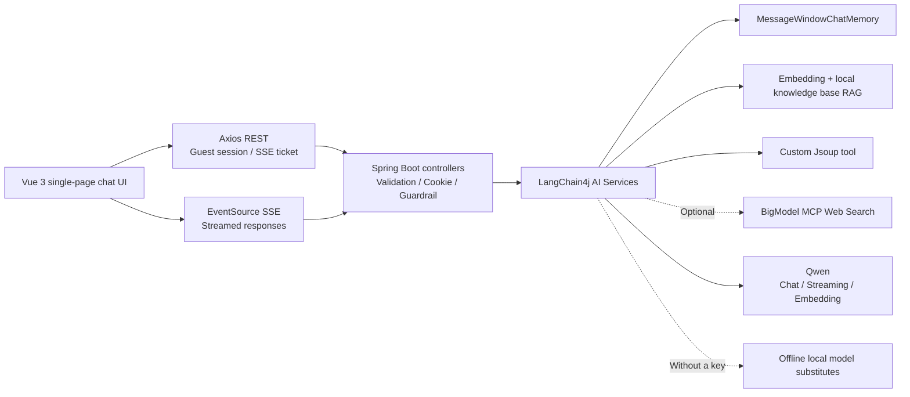
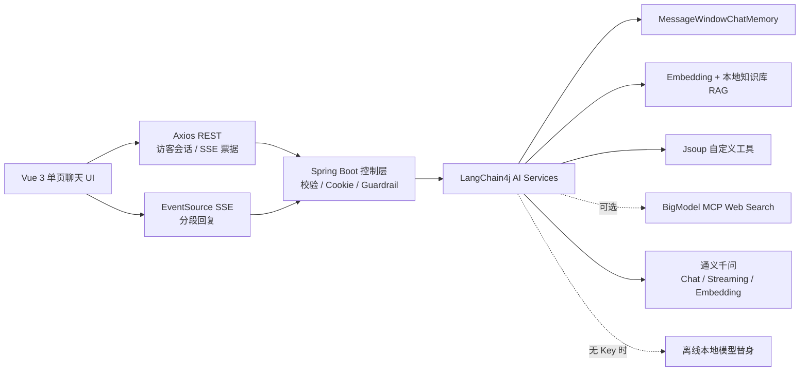

[English](#english) | [简体中文](#简体中文)

<a id="english"></a>

# English

# AI Code Helper

[](https://github.com/GU2thousand/ai-code-helper/actions/workflows/ci.yml)

A runnable full-stack AI assistant for learning programming. The Vue 3 frontend submits messages with Axios and displays streamed responses through native SSE. The Spring Boot 3.5 backend uses LangChain4j to manage conversation memory, RAG, tools, MCP, guardrails, and Qwen models.

Without external API keys, the project automatically enters local demo mode. Chat, streaming, memory, RAG, user sessions, and all tests can still run offline. Once a DashScope key is configured, the same endpoints automatically switch to Qwen Chat, Streaming Chat, and Embedding models.

## Architecture



The browser does not put message bodies or access tokens in SSE URLs. The frontend first calls `POST /api/ai/chat/streams` to create a random ticket that expires after 30 seconds, is bound to a signed identity, and can be consumed only once. It then opens EventSource with `GET /api/ai/chat/streams/{streamId}`.

## Requirements

- Java 21+
- Maven 3.6+
- Node.js 20.19+, or 22.12+

Node.js 16, mentioned in the original specification, has reached the end of security maintenance. To avoid disclosed development-server vulnerabilities in older Vite/Vitest versions, this implementation raised its frontend baseline to Node 20.19 and adopted a toolchain whose recorded audit reported zero vulnerabilities. Node 16 compatibility is therefore not promised.

## Quick start

Start the backend first. Without a key, it runs in local demo mode:

```bash
cd backend
mvn spring-boot:run
```

Then start the frontend:

```bash
cd frontend
npm ci
npm run dev
```

Open `http://localhost:5173`. The backend defaults to port `8081`. If it is occupied, set `SERVER_PORT` and configure the matching `VITE_API_BASE_URL` in the frontend's `.env.local`.

## Connect Qwen and MCP

Provide secrets through environment variables or a secret manager; do not commit them to the repository:

```bash
export DASHSCOPE_API_KEY='your-dashscope-key'
export DASHSCOPE_EMBEDDING_API_KEY='your-embedding-key' # Optional; defaults to the key above
export APP_AUTH_TOKEN_SECRET="$(openssl rand -hex 32)"

# Optional: BigModel Web Search MCP
export BIGMODEL_MCP_ENABLED=true
export BIGMODEL_API_KEY='your-bigmodel-key'

cd backend
mvn spring-boot:run
```

The default models are `qwen-max` and `text-embedding-v4`. MCP uses Streamable HTTP and a Bearer header. It is disabled by default and makes no network connection at startup. When enabled, only Web Search tools on the configured allowlist are authorized.

See [backend/.env.example](backend/.env.example) for the full variable list, [backend/README.md](backend/README.md) for backend documentation, and [frontend/README.md](frontend/README.md) for frontend documentation.

## Implemented features

- Responsive Vue 3 chat UI, local history for multiple conversations, stop/regenerate actions, Markdown, syntax highlighting, and code copying.
- Axios REST, HttpOnly guest-session cookies, short-lived single-use SSE tickets, and an explicit `done/[DONE]` completion contract.
- Standard chat, SSE streaming chat, four-week structured reports parsed directly into Java objects by LangChain4j, and a RAG API with sources and scores.
- MessageWindowChatMemory isolated by signed user identity and `memoryId`; when capacity is reached, inactive LRU sessions are evicted synchronously from both LangChain4j caches.
- Qwen Chat, Streaming Chat, and Embedding, with automatic offline substitutes when no key is provided.
- A local Markdown knowledge base, in-memory vector retrieval, and a custom Jsoup interview-question tool.
- Optional BigModel MCP Web Search with lazy connections, failure backoff, Bearer headers, and a tool allowlist.
- Two layers of input guardrails, length and format validation, HMAC sessions, security headers, exact CORS matching, and privacy-conscious logging.
- Mutual exclusion within a conversation, global and per-user concurrency/rate limits, per-user limits on pending SSE tickets, and transactional memory rollback for failed streams.
- Mobile layouts, keyboard operation, focus constraints, ARIA semantics, a strict Markdown tag allowlist, and XSS/phishing protection.

## Main endpoints

| Method | Path | Purpose |
| --- | --- | --- |
| `GET` | `/api/health` | Model, embedding, MCP, and knowledge-base status |
| `POST` | `/api/users/guest` | Create or renew a signed guest cookie |
| `POST` | `/api/ai/chat` | Standard chat |
| `POST` | `/api/ai/chat/streams` | Submit a message and create a single-use SSE ticket |
| `GET` | `/api/ai/chat/streams/{streamId}` | Consume a ticket and receive streamed responses |
| `POST` | `/api/ai/rag` | RAG answers with cited sources |
| `POST` | `/api/ai/report` | Structured learning and job-search reports |

SSE `message` events carry JSON (`{"content":" incremental text"}`) to preserve whitespace and code indentation. `sources` events carry retrieved knowledge metadata; the chat UI displays the source titles. Errors before a stream opens return JSON with the appropriate HTTP status, even when the request accepts `text/event-stream`. Both Vite development (5173) and production preview (4173) are allowed by the default local CORS configuration.

The legacy `GET /api/ai/chat?memoryId=...&message=...` remains compatible but is deprecated and has an input-length limit. New code should use the ticket protocol.

## Validation

```bash
cd backend
mvn test
mvn package

cd ../frontend
npm test
npm run build
npm audit
```

Tests run fully offline and cover guest signatures and renewal, identity isolation, memory and regeneration rollback, guardrails, RAG sources, local embeddings, tool parsing, ticket ownership/expiry/single-use enforcement, SSE completion, frontend stream races, Markdown security, and accessible interactions.

The recorded baseline passed 35 backend tests on Temurin Java 21.0.11 and 28 frontend tests on Node.js 20.19.0. A clean `npm ci`, production build, and `npm audit` succeeded, with zero reported vulnerabilities. Recorded browser QA covered guest initialization → POST ticket creation → EventSource streaming → `done` → regeneration, no horizontal overflow at 320px, mobile sidebar focus restoration, and malicious Markdown/XSS input, with zero console errors. These are the project's existing validation records, not new test results from this documentation update.

GitHub Actions repeats the Java 21 backend build and Node 20 frontend tests, build, and dependency audit on every push and pull request.

## Directory structure

```text
.
├── backend/    # Java 21 + Spring Boot 3.5 + LangChain4j
└── frontend/   # Vue 3 + Axios + EventSource
```

By default, completed conversation memory and an automatically generated signing key persist in `APP_DATA_DIR` (`./data`). Mount this private directory on a persistent volume to retain valid guest sessions and conversation context across process/container restarts. `APP_AUTH_TOKEN_SECRET` overrides the stored signing key; rotating it intentionally invalidates existing sessions. Guest tokens still expire after `APP_GUEST_TTL` (12 hours by default). Snapshots contain conversation text, are written atomically with owner-only permissions on POSIX systems, and are capped at `AI_MAX_CONVERSATIONS` (oldest saved conversations are removed). Failed/cancelled turns are not committed. `APP_STORAGE_ENABLED=false` opts into ephemeral demo storage. This file store supports a single backend instance; multi-instance production needs a shared transactional database, TTL/backup/access-control policies and a stable secret. The knowledge vector index is rebuilt lazily in memory.

## Data and external services

- When Qwen is enabled, user input, necessary conversation context, and structured-report requests are sent to Alibaba Cloud DashScope.
- When BigModel MCP is enabled and the model selects its search tool, search parameters are sent to BigModel. The Jsoup interview-question tool accesses the configured Nowcoder search address.
- Default offline mode does not call these external services. Before production use, review the relevant terms, scraping policies, regional compliance, quotas, and cost alerts.
- The current DashScope SDK cancellation handle does not guarantee termination of an upstream HTTP request already sent. The application stops callbacks, restores failed sessions, and releases local capacity, but production deployments still need provider timeouts and budget limits.

---

<a id="简体中文"></a>

# 简体中文

# AI 编程助手

[](https://github.com/GU2thousand/ai-code-helper/actions/workflows/ci.yml)

一个可直接运行的全栈 AI 编程学习助手：Vue 3 前端通过 Axios 提交消息，再用原生 SSE 实时显示分段回复；Spring Boot 3.5 后端通过 LangChain4j 管理会话记忆、RAG、工具、MCP、Guardrail 与通义千问模型。

没有任何外部 API Key 时，项目会自动进入本地演示模式，聊天、流式输出、记忆、RAG、用户会话和全部测试仍可离线运行。配置 DashScope Key 后，同一套接口自动切换到通义千问 Chat、Streaming Chat 与 Embedding Model。

## 架构



浏览器不会把消息正文或访问令牌放入 SSE URL。前端先 `POST /api/ai/chat/streams` 创建一个 30 秒有效、绑定签名身份、仅可消费一次的随机票据，再用 `GET /api/ai/chat/streams/{streamId}` 打开 EventSource。

## 环境要求

- Java 21+
- Maven 3.6+
- Node.js 20.19+，或 22.12+

原始说明中的 Node.js 16 已结束安全维护。为了避免旧 Vite/Vitest 已公开的开发服务器漏洞，本实现将实际前端基线提升到 Node 20.19，并使用审计为 0 漏洞的当前工具链；因此不承诺在 Node 16 上运行。

## 快速启动

先启动后端；不设置 Key 即为本地演示模式：

```bash
cd backend
mvn spring-boot:run
```

再启动前端：

```bash
cd frontend
npm ci
npm run dev
```

打开 `http://localhost:5173`。后端默认端口为 `8081`；如果端口被占用，可用 `SERVER_PORT` 修改，并在前端 `.env.local` 中设置对应的 `VITE_API_BASE_URL`。

## 接入通义千问与 MCP

密钥只通过环境变量或密钥管理服务提供，不要写入仓库：

```bash
export DASHSCOPE_API_KEY='your-dashscope-key'
export DASHSCOPE_EMBEDDING_API_KEY='your-embedding-key' # 可选，默认复用上面的 Key
export APP_AUTH_TOKEN_SECRET="$(openssl rand -hex 32)"

# 可选：智谱 BigModel Web Search MCP
export BIGMODEL_MCP_ENABLED=true
export BIGMODEL_API_KEY='your-bigmodel-key'

cd backend
mvn spring-boot:run
```

默认使用 `qwen-max` 与 `text-embedding-v4`。MCP 使用 Streamable HTTP 和 Bearer Header，默认关闭，启动时不会联网；开启后也只授权配置白名单中的 Web Search 工具。

完整变量见 [backend/.env.example](backend/.env.example)，后端说明见 [backend/README.md](backend/README.md)，前端说明见 [frontend/README.md](frontend/README.md)。

## 已实现能力

- Vue 3 响应式聊天界面、多会话本地记录、停止/重新生成、Markdown、代码高亮与复制。
- Axios REST、HttpOnly Cookie 访客会话、短期一次性 SSE 票据和显式 `done/[DONE]` 完成契约。
- 普通聊天、SSE 流式聊天、由 LangChain4j 直接解析为 Java 对象的四周结构化报告，以及带来源/分数的 RAG API。
- 以签名用户身份和 `memoryId` 共同隔离的 MessageWindowChatMemory；容量满时同步驱逐两套 LangChain4j 缓存中的非活跃 LRU 会话。
- 通义千问 Chat、Streaming Chat、Embedding；无 Key 时自动使用离线替身。
- 本地 Markdown 知识库、内存向量检索、自定义 Jsoup 面试题工具。
- 可选 BigModel MCP Web Search，惰性连接、失败退避、Bearer Header、工具白名单。
- 双层输入 Guardrail、长度与格式校验、HMAC 会话、安全响应头、精确 CORS、隐私友好日志。
- 同一会话互斥、全局/单用户并发与频率上限、单用户待用 SSE 票据上限，以及失败流的记忆事务回滚。
- 移动端布局、键盘操作、焦点约束、ARIA 语义、严格 Markdown 标签白名单和 XSS/钓鱼防护。

## 主要接口

| 方法 | 路径 | 用途 |
| --- | --- | --- |
| `GET` | `/api/health` | 模型、Embedding、MCP 与知识库状态 |
| `POST` | `/api/users/guest` | 创建或续期签名访客 Cookie |
| `POST` | `/api/ai/chat` | 普通聊天 |
| `POST` | `/api/ai/chat/streams` | 提交消息并创建一次性 SSE 票据 |
| `GET` | `/api/ai/chat/streams/{streamId}` | 消费票据并接收分段回复 |
| `POST` | `/api/ai/rag` | RAG 回答及引用来源 |
| `POST` | `/api/ai/report` | 结构化学习与求职报告 |

SSE `message` 事件使用 JSON（`{"content":" 增量文本"}`），保留空格和代码缩进；`sources` 事件传递检索来源，聊天界面显示来源标题。流尚未建立时的错误返回正确 HTTP 状态及 JSON，即使请求 Accept 为 `text/event-stream`。默认本地 CORS 同时允许开发端口 5173 和构建预览端口 4173。

旧式 `GET /api/ai/chat?memoryId=...&message=...` 仍兼容，但已标记弃用并限制输入长度；新代码应使用票据协议。

## 验证

```bash
cd backend
mvn test
mvn package

cd ../frontend
npm test
npm run build
npm audit
```

测试完全离线，覆盖访客签名与续期、身份隔离、记忆与重新生成回退、Guardrail、RAG 来源、本地 Embedding、工具解析、票据归属/过期/单次消费、SSE 完成契约、前端流竞态、Markdown 安全和无障碍交互。

当前基线在 Temurin Java 21.0.11 下通过 35 项后端测试，在 Node.js 20.19.0 下通过 28 项前端测试；从空依赖目录执行 `npm ci`、生产构建和 `npm audit` 均成功，审计为 0 漏洞。真实浏览器 QA 已覆盖“访客初始化 → POST 创建票据 → EventSource 分段回复 → `done` → 重新生成”、320px 无横向溢出、移动侧栏焦点恢复和恶意 Markdown/XSS 输入，控制台 0 错误。

以上为项目既有验证记录，并非本次文档更新重新执行的测试结果。

GitHub Actions 会在每次 push 和 pull request 上重复执行 Java 21 后端构建与 Node 20 前端测试、构建和依赖审计。

## 目录

```text
.
├── backend/    # Java 21 + Spring Boot 3.5 + LangChain4j
└── frontend/   # Vue 3 + Axios + EventSource
```

默认将成功完成的会话记忆和自动生成的签名密钥保存在 `APP_DATA_DIR`（`./data`）。容器部署应挂载私有持久卷，才能跨进程/容器重启保留有效访客身份和对话上下文。`APP_AUTH_TOKEN_SECRET` 优先于磁盘密钥；更换密钥会使旧会话失效。访客令牌仍遵循 `APP_GUEST_TTL`（默认 12 小时）。快照包含聊天内容，使用原子写入和 POSIX 所有者专属权限，最多保留 `AI_MAX_CONVERSATIONS` 份，超限删除最早保存的会话；失败和取消的请求不提交。`APP_STORAGE_ENABLED=false` 可切换为临时演示存储。文件存储仅支持单后端实例；多实例生产部署需要共享事务数据库、TTL/备份/访问控制策略及稳定密钥。知识向量索引仍在内存中惰性重建。

## 数据与外部服务说明

- 启用通义千问后，用户输入、必要的会话上下文和结构化报告请求会发送给阿里云 DashScope。
- 启用 BigModel MCP 后，模型选择搜索工具时会把搜索参数发送给 BigModel；调用 Jsoup 面试题工具时会访问配置的牛客搜索地址。
- 默认离线模式不会调用上述外部服务。生产使用前应确认对应服务条款、抓取策略、区域合规、配额和成本告警。
- 当前 DashScope SDK 的取消句柄不保证终止已经发出的上游 HTTP 请求；应用会停止回调、恢复失败会话并释放本地额度，但生产环境仍需配置供应商超时与预算上限。
