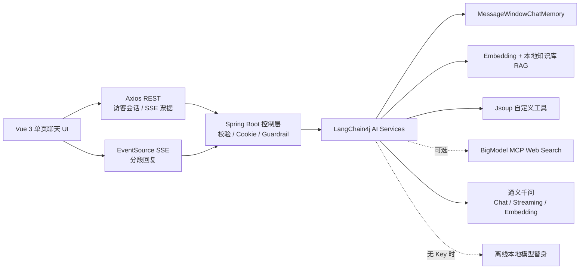

# AI 编程助手

[](https://github.com/GU2thousand/ai-code-helper/actions/workflows/ci.yml)

一个可直接运行的全栈 AI 编程学习助手：Vue 3 前端通过 Axios 提交消息，再用原生 SSE 实时显示分段回复；Spring Boot 3.5 后端通过 LangChain4j 管理会话记忆、RAG、工具、MCP、Guardrail 与通义千问模型。

没有任何外部 API Key 时，项目会自动进入本地演示模式，聊天、流式输出、记忆、RAG、用户会话和全部测试仍可离线运行。配置 DashScope Key 后，同一套接口自动切换到通义千问 Chat、Streaming Chat 与 Embedding Model。

## 架构



浏览器不会把消息正文或访问令牌放入 SSE URL。前端先 `POST /api/ai/chat/streams` 创建一个 30 秒有效、绑定签名身份、仅可消费一次的随机票据，再用 `GET /api/ai/chat/streams/{streamId}` 打开 EventSource。

## 环境要求

- Java 21+
- Maven 3.6+
- Node.js 20.19+，或 22.12+

原始说明中的 Node.js 16 已结束安全维护。为了避免旧 Vite/Vitest 已公开的开发服务器漏洞，本实现将实际前端基线提升到 Node 20.19，并使用审计为 0 漏洞的当前工具链；因此不承诺在 Node 16 上运行。

## 快速启动

先启动后端；不设置 Key 即为本地演示模式：

```bash
cd backend
mvn spring-boot:run
```

再启动前端：

```bash
cd frontend
npm ci
npm run dev
```

打开 `http://localhost:5173`。后端默认端口为 `8081`；如果端口被占用，可用 `SERVER_PORT` 修改，并在前端 `.env.local` 中设置对应的 `VITE_API_BASE_URL`。

## 接入通义千问与 MCP

密钥只通过环境变量或密钥管理服务提供，不要写入仓库：

```bash
export DASHSCOPE_API_KEY='your-dashscope-key'
export DASHSCOPE_EMBEDDING_API_KEY='your-embedding-key' # 可选，默认复用上面的 Key
export APP_AUTH_TOKEN_SECRET="$(openssl rand -hex 32)"

# 可选：智谱 BigModel Web Search MCP
export BIGMODEL_MCP_ENABLED=true
export BIGMODEL_API_KEY='your-bigmodel-key'

cd backend
mvn spring-boot:run
```

默认使用 `qwen-max` 与 `text-embedding-v4`。MCP 使用 Streamable HTTP 和 Bearer Header，默认关闭，启动时不会联网；开启后也只授权配置白名单中的 Web Search 工具。

完整变量见 [backend/.env.example](backend/.env.example)，后端说明见 [backend/README.md](backend/README.md)，前端说明见 [frontend/README.md](frontend/README.md)。

## 已实现能力

- Vue 3 响应式聊天界面、多会话本地记录、停止/重新生成、Markdown、代码高亮与复制。
- Axios REST、HttpOnly Cookie 访客会话、短期一次性 SSE 票据和显式 `done/[DONE]` 完成契约。
- 普通聊天、SSE 流式聊天、由 LangChain4j 直接解析为 Java 对象的四周结构化报告，以及带来源/分数的 RAG API。
- 以签名用户身份和 `memoryId` 共同隔离的 MessageWindowChatMemory；容量满时同步驱逐两套 LangChain4j 缓存中的非活跃 LRU 会话。
- 通义千问 Chat、Streaming Chat、Embedding；无 Key 时自动使用离线替身。
- 本地 Markdown 知识库、内存向量检索、自定义 Jsoup 面试题工具。
- 可选 BigModel MCP Web Search，惰性连接、失败退避、Bearer Header、工具白名单。
- 双层输入 Guardrail、长度与格式校验、HMAC 会话、安全响应头、精确 CORS、隐私友好日志。
- 同一会话互斥、全局/单用户并发与频率上限、单用户待用 SSE 票据上限，以及失败流的记忆事务回滚。
- 移动端布局、键盘操作、焦点约束、ARIA 语义、严格 Markdown 标签白名单和 XSS/钓鱼防护。

## 主要接口

| 方法 | 路径 | 用途 |
| --- | --- | --- |
| `GET` | `/api/health` | 模型、Embedding、MCP 与知识库状态 |
| `POST` | `/api/users/guest` | 创建或续期签名访客 Cookie |
| `POST` | `/api/ai/chat` | 普通聊天 |
| `POST` | `/api/ai/chat/streams` | 提交消息并创建一次性 SSE 票据 |
| `GET` | `/api/ai/chat/streams/{streamId}` | 消费票据并接收分段回复 |
| `POST` | `/api/ai/rag` | RAG 回答及引用来源 |
| `POST` | `/api/ai/report` | 结构化学习与求职报告 |

旧式 `GET /api/ai/chat?memoryId=...&message=...` 仍兼容，但已标记弃用并限制输入长度；新代码应使用票据协议。

## 验证

```bash
cd backend
mvn test
mvn package

cd ../frontend
npm test
npm run build
npm audit
```

测试完全离线，覆盖访客签名与续期、身份隔离、记忆与重新生成回退、Guardrail、RAG 来源、本地 Embedding、工具解析、票据归属/过期/单次消费、SSE 完成契约、前端流竞态、Markdown 安全和无障碍交互。

当前基线在 Temurin Java 21.0.11 下通过 35 项后端测试，在 Node.js 20.19.0 下通过 28 项前端测试；从空依赖目录执行 `npm ci`、生产构建和 `npm audit` 均成功，审计为 0 漏洞。真实浏览器 QA 已覆盖“访客初始化 → POST 创建票据 → EventSource 分段回复 → `done` → 重新生成”、320px 无横向溢出、移动侧栏焦点恢复和恶意 Markdown/XSS 输入，控制台 0 错误。

GitHub Actions 会在每次 push 和 pull request 上重复执行 Java 21 后端构建与 Node 20 前端测试、构建和依赖审计。

## 目录

```text
.
├── backend/    # Java 21 + Spring Boot 3.5 + LangChain4j
└── frontend/   # Vue 3 + Axios + EventSource
```

当前会话记忆和向量库位于进程内，适合开发与演示；生产环境应迁移到带 TTL、容量、备份和访问控制的持久化存储，并在网关层配置 TLS、限流和请求大小限制。

## 数据与外部服务说明

- 启用通义千问后，用户输入、必要的会话上下文和结构化报告请求会发送给阿里云 DashScope。
- 启用 BigModel MCP 后，模型选择搜索工具时会把搜索参数发送给 BigModel；调用 Jsoup 面试题工具时会访问配置的牛客搜索地址。
- 默认离线模式不会调用上述外部服务。生产使用前应确认对应服务条款、抓取策略、区域合规、配额和成本告警。
- 当前 DashScope SDK 的取消句柄不保证终止已经发出的上游 HTTP 请求；应用会停止回调、恢复失败会话并释放本地额度，但生产环境仍需配置供应商超时与预算上限。
