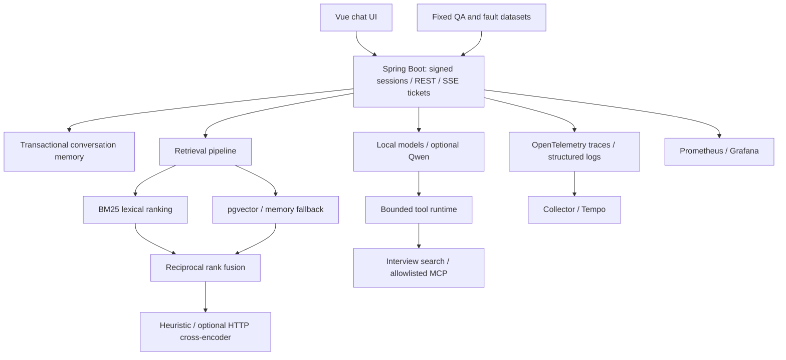

[English](#english) | [简体中文](#简体中文)

<a id="english"></a>

# AI Code Helper

[](https://github.com/GU2thousand/ai-code-helper/actions/workflows/ci.yml)
[](https://github.com/GU2thousand/ai-code-helper/actions/workflows/ai-system-validation.yml)

A programming assistant and reproducible AI engineering testbed built with Vue 3, Spring Boot 3.5, LangChain4j, and optional Qwen/MCP providers. It compares retrieval pipelines on fixed evidence, bounds tool execution, traces request stages, and tests cancellation and dependency failures. Without provider keys, deterministic local models support development and system verification.

**The measured local default is BM25.** Hybrid search and reranking are configurable experiments. Local hash embeddings and a heuristic reranker do not establish real model quality; answer accuracy and live tool-selection accuracy remain unmeasured.

## Architecture



## Engineering decisions

| Problem | Implementation | Evidence |
| --- | --- | --- |
| A plausible answer may use the wrong evidence | Stable chunk citations, evidence-anchor retrieval scoring, separate answer evaluator | 112 fixed bilingual QA cases; per-query JSON/CSV |
| Vector retrieval may be worse than lexical matching | Four selectable modes with identical corpus and query inputs | Measured comparison below; BM25 remains default |
| Tools can fail, repeat, or loop | Unified results, allowlist, deadlines, retries, deduplication and step limits | 60 controlled cases covering 15 fixtures |
| Cancellation can corrupt memory or free capacity too early | Callback fencing, rollback and physical provider capacity tracking | Provider, stream and failure-injection regressions |
| A slow response needs an explanation | Request/stage traces, duration histograms and bounded metrics | Compose smoke verifies stored traces and metric scraping |

## Retrieval and ingestion

`RETRIEVAL_MODE` selects `vector`, `lexical`, `hybrid`, or `hybrid_rerank`. Chunking preserves source, section, source hash and stable chunk IDs. Indexing detects duplicate documents, reuses unchanged embeddings, removes deleted chunks, and records embedding model/version and corpus identity.

The PostgreSQL repository stores vectors with pgvector and uses exact cosine search. The current corpus is small; it does **not** claim HNSW/ANN scale. BM25 is implemented in Java over the same captured chunk snapshot, including Chinese tokenization. Hybrid mode uses Reciprocal Rank Fusion with 25 candidates and `k=60`. Reranking considers at most 30 candidates; the built-in token-overlap reranker is a deterministic heuristic. An optional HTTP cross-encoder adapter validates score count/values and falls back to the fused order on failure.

Database outages fall back to the process's in-memory index with explicit degradation metadata. If corpus embedding fails on cold start, raw chunks still support lexical/hybrid results with an explicit incomplete-index warning and bounded retry backoff; vector-only requests fail until real vectors are available. Queries validate database corpus/model/version identity and retain one immutable local snapshot. One PostgreSQL collection is supported: independently deployed corpora should use separate databases. Do not use this as a multi-tenant vector service.

Returned sources include exact chunk IDs. Answers can cite `[chunk:ID]`; the UI resolves only unique known IDs to numbered buttons and opens the corresponding plain-text source. Unknown or ambiguous IDs remain visibly unmatched. A valid ID proves source identity, not that the answer follows from its contents.

## Bounded agent runtime

LangChain4j performs model tool selection. All registered local/MCP tool execution passes through `ToolRequest`, `ToolResult`, `ToolError`, `ToolMetadata` and `ToolPolicy`:

- At most **6 steps**, **2 retries**, **3 calls per tool**, **10 seconds per tool**, and **30 seconds total tool time** by default.
- Explicit read-only policies and MCP allowlists; unauthorized calls and higher-risk policies are rejected.
- Structured failures for timeouts, HTTP 5xx, malformed/empty results, duplicates, unavailable providers, MCP connection failures, exhausted budgets and cancellation.
- Physical execution permits remain occupied until underlying work exits, even when an application deadline has already returned an error.

The existing interview search and optional BigModel web search are integrated. Additional documentation/code-search tools from the conceptual roadmap are future extensions, not fabricated implementations.

## Reliability and APIs

Signed HttpOnly guest cookies isolate memory by owner and conversation ID. A conversation admits one active turn; failed/cancelled turns restore the snapshot and do not commit. Global/per-owner admission limits and provider capacity are independent.

The browser submits message bodies to `POST /api/ai/chat/streams`, then consumes a random, owner-bound, single-use 30-second ticket through `GET /api/ai/chat/streams/{streamId}`. SSE preserves incremental JSON content and emits explicit `done: [DONE]`. The deprecated GET chat query remains compatible; use tickets for new clients.

| Endpoint | Purpose |
| --- | --- |
| `GET /api/health` | Model/MCP status and already-known index state |
| `POST /api/users/guest` | Create/renew guest session |
| `POST /api/ai/chat` | Standard chat |
| `POST /api/ai/chat/streams` | Create stream ticket |
| `GET /api/ai/chat/streams/{streamId}` | Consume ticket |
| `POST /api/ai/rag` | Answer with source metadata |
| `POST /api/ai/report` | Structured learning report |
| `GET /actuator/prometheus` | Operational metrics |
| `/api/evaluation/{status,retrieval,agent}` | Opt-in authenticated diagnostics |

Provider defaults are 45s chat, 20s embedding, 15s first stream content and 90s total stream time, with 16 shared physical in-flight calls. The servlet stream deadline remains a separate upper bound. Cancellation stops downstream callbacks and restores application state; the upstream SDK may continue an already-sent HTTP request. Such work retains its physical permit until completion.

## Evaluation methodology and measured results

Baseline evaluation is measured on a fixed programming QA set. All numbers below are generated by the reproducible scripts in [`evaluation/`](evaluation/README.md). The corpus contains 11 Markdown documents and 272 chunks. There are **112 unique QA questions** (104 answerable, 8 no-answer), with fixed dev/test and English/Chinese labels. The retrieval and answer files contain the same questions. The corpus and cases were authored together; this is a development benchmark, not an independent quality audit.

Recall checks exact evidence anchors inside retrieved chunks. A correct filename with an unrelated paragraph earns no credit. MRR uses the first evidence hit. Three warmups per mode are excluded. Latency is server retrieval duration, not end-to-end answer latency. Each run retains dataset/script/corpus hashes, code revision, server configuration, degradation and raw rankings.

<!-- RETRIEVAL_RESULTS_START -->
Measured on 2026-09-21 UTC from clean source [`d4520ab`](https://github.com/GU2thousand/ai-code-helper/commit/d4520ab96d00701c5386d7999fbaa1dc90a6c039), with PostgreSQL/pgvector, `local-hash-embedding` v1, k=5 and the heuristic reranker. [Image/configuration manifest](evaluation/results/verification-manifest.json) binds the serving containers to that revision. All four runs completed without HTTP errors or degradation.

| Pipeline | Recall@1 | Recall@3 | Recall@5 | MRR | Mean retrieval | p95 retrieval | Answer accuracy |
| --- | ---: | ---: | ---: | ---: | ---: | ---: | --- |
| [Vector only](evaluation/results/baseline-v1.json) | 45.19% | 57.69% | 66.35% | 0.5234 | 10.27 ms | 18.06 ms | Unmeasured |
| [BM25 lexical](evaluation/results/lexical-v1.json) | 93.27% | 99.04% | 99.04% | 0.9567 | 6.57 ms | 10.92 ms | Unmeasured |
| [Hybrid RRF](evaluation/results/hybrid-v1.json) | 71.15% | 88.46% | 92.31% | 0.8029 | 14.55 ms | 18.99 ms | Unmeasured |
| [Hybrid + heuristic reranker](evaluation/results/hybrid_rerank-v1.json) | 88.46% | 97.12% | 98.08% | 0.9271 | 16.35 ms | 21.21 ms | Unmeasured |

Fixed test split: 38 questions, including 34 answerable and 4 no-answer cases. No cases were changed after comparison; source/question co-authorship still limits independence.

| Pipeline | Test Recall@5 | Test MRR |
| --- | ---: | ---: |
| Vector only | 61.76% | 0.4765 |
| BM25 lexical | 100.00% | 0.9314 |
| Hybrid RRF | 88.24% | 0.7451 |
| Hybrid + heuristic reranker | 100.00% | 0.9289 |

**No-answer abstention was 0/8 for every mode** (false-positive rate 100%): all unsupported queries returned chunks. This is a retrieval rejection failure, not a measured LLM hallucination rate. Full per-query CSV/JSON and language/category summaries are retained in [`evaluation/results/`](evaluation/results/). Sequential single-run timings are descriptive and do not prove a latency improvement.
<!-- RETRIEVAL_RESULTS_END -->

`baseline-v1` means **vector-only on the upgraded fixed corpus**, not a historical measurement of the old three-document implementation. No before/after claim across different corpora is made. The default follows the measured local winner; changing to real embeddings requires a new comparison. Ranking metrics do not measure answer accuracy.

<!-- AGENT_RESULTS_START -->
[Controlled runtime run](evaluation/results/agent-runtime-v1.json): **60/60 expected contracts passed**, with no evaluation HTTP errors. Across the intentionally failing fixtures, tool-result success was 43.48%, average underlying calls 1.67, average entered steps 1.40, task completion 13.33%, timeout rate 4.35%, 32 retries and 8 loop-prevention results. These different denominators are defined in the evaluator; none is a production reliability estimate.
<!-- AGENT_RESULTS_END -->

The 60 agent cases repeat 15 controlled fixtures four times. Contract pass checks expected outcomes; injected failures intentionally lower execution success and completion. **Tool-selection accuracy is null:** no real planner was invoked. The answer evaluator rejects local/mock results, supports actual provider exports/live runs, resolves chunk citations, and optionally accepts an external judge. Lexical coverage/citation proxies are labeled separately from semantic correctness, faithfulness and hallucination metrics.

## Observability and load testing

OpenTelemetry spans cover auth/session, retrieval, lexical/vector/reranking when used, model calls, tool steps and streaming. Compose connects the collector to Tempo and provisions a Grafana dashboard with request p50/p95, stage durations, errors, token usage and active streams.

Prometheus exports `ai_requests_total`, `ai_request_duration_seconds`, `llm_request_duration_seconds`, `retrieval_duration_seconds`, `reranker_duration_seconds`, `tool_calls_total`, `tool_failures_total`, `agent_steps_total`, `input_tokens_total`, `output_tokens_total`, `active_sse_streams`, and `rag_no_hit_total`. Token counts come only from actual reported usage; zero local counters do not mean zero-cost real inference. Price conversion/cost accounting is not implemented.

Structured request logs include request/trace ID, model, mode, duration, tool count and status. Prompts, cookies, secrets and raw identity/conversation IDs are excluded. Nginx API access logging avoids compatibility GET query exposure.

[`load-tests/`](load-tests/README.md) includes k6 chat 10/50/100-VU, mixed RAG and provider-gated tool scenarios, plus an incremental SSE client with actual first-content timing. HTTP 429 saturation is reported separately from unexpected failures. VUs include think time and do not imply that every user is simultaneously admitted. [`failure-injection.md`](load-tests/failure-injection.md) maps database, reranker, MCP and provider failures to executable checks.

<!-- LOAD_RESULTS_START -->
[Seven recorded samples](load-tests/results/local-v1/README.md), 2026-09-21 UTC: 10-second launch windows, 3.1s think time, local models, lexical retrieval/pgvector, persistence and tracing enabled. The isolated backend restarted before each sample to reset admission windows; no separate warmup. Limits remained 64 application requests, 16 physical provider calls and 300 starts/minute. Short samples include JVM startup effects.

| Workload / users | Success / attempts | HTTP 429 | Unexpected failures | Success p95 | Success / second |
| --- | ---: | ---: | ---: | ---: | ---: |
| [Chat 10](load-tests/results/local-v1/chat10.json) | 30/30 | 0 | 0 (0.00%) | 599.3 ms | 2.89 |
| [Chat 50](load-tests/results/local-v1/chat50.json) | 150/150 | 0 | 0 (0.00%) | 1294.2 ms | 12.85 |
| [Chat 100](load-tests/results/local-v1/chat100.json) | 238/303 | 36 | 29 (9.57%) | 1262.1 ms | 18.18 |
| [RAG 10](load-tests/results/local-v1/rag.json) | 30/30 | 0 | 0 (0.00%) | 572.9 ms | 2.96 |
| [SSE 10](load-tests/results/local-v1/sse10.json) | 30/30 | 0 | 0 (0.00%) | 689.8 ms | 3.00 |
| [SSE 50](load-tests/results/local-v1/sse50.json) | 88/150 | 0 | 62 (41.33%) | 1225.7 ms | 8.79 |
| [SSE 100](load-tests/results/local-v1/sse100.json) | 146/300 | 36 | 118 (39.33%) | 1750.2 ms | 14.59 |

**Chat 100 and SSE 50/100 failed the load acceptance thresholds.** Chat 100's 29 unexpected failures were HTTP 503. The SSE failures were provider errors after the response opened; their baseline payload codes were not retained. A separate diagnostic run captured 111 `AI_PROVIDER_CAPACITY` SSE errors; it is recorded separately and does not relabel or replace baseline failures. These results expose the configured capacity boundary and do not establish 100-user production readiness. No capacity settings or error classifications were changed to make the runs pass. All SSE runs drained to zero active streams; observed peak open responses were 10, 50 and 63 respectively. Raw TTFT p50/p95/p99, resource samples, status counters and exit codes remain in the linked artifacts.
<!-- LOAD_RESULTS_END -->

## Run locally

The full isolated stack needs Docker Compose; no provider keys are required:

```bash
docker compose up --build --detach --wait --wait-timeout 240
python3 deployment/smoke.py
```

Open `http://localhost:5173`; Grafana is `http://localhost:3000` (`admin` / `local-development-only`). Ports bind to localhost. PostgreSQL, conversations/signing secret, metrics and traces use named volumes. See [`deployment/README.md`](deployment/README.md) for ports, lifecycle and overrides.

For standalone development, use Java 21+, Maven 3.6+, and Node 20.19+ or 22.12+:

```bash
mvn -f backend/pom.xml spring-boot:run
# In another terminal:
cd frontend
npm ci
npm run dev
```

A full local retrieval/runtime evaluation needs only a diagnostic key, not a model key:

```bash
APP_EVALUATION_ENABLED=true APP_EVALUATION_KEY=local-evaluation-only \
  docker compose up --build --detach --wait --wait-timeout 240
APP_EVALUATION_KEY=local-evaluation-only python3 evaluation/scripts/run_benchmark.py
APP_EVALUATION_KEY=local-evaluation-only python3 evaluation/scripts/run_agent_eval.py
```

Evaluation routes are disabled by default and require `X-Evaluation-Key` when enabled. Do not expose the diagnostics/monitoring stack publicly. To connect real providers in standalone mode, configure `DASHSCOPE_API_KEY` and optionally `BIGMODEL_MCP_ENABLED`/`BIGMODEL_API_KEY`. Compose intentionally uses the offline `local` profile. [`backend/.env.example`](backend/.env.example) documents the main application overrides; Spring Boot does not automatically load that file.

## Validation

```bash
mvn -f backend/pom.xml test
npm --prefix frontend test
npm --prefix frontend run build
python3 evaluation/scripts/validate_datasets.py
python3 -m unittest discover -s evaluation/tests -v
python3 -m unittest discover -s load-tests -p 'test_*.py' -v
```

Recorded verification: **159 backend tests passed with no skips**, including the real PostgreSQL cases; **46 frontend**, **22 evaluator**, and **11 load-client** tests passed, as did the production frontend build and dependency audit (zero reported vulnerabilities). The final container smoke passed all **11** HTTP, SSE, source, metric, dashboard and stored-trace checks. These local/controlled checks do not establish real-provider quality.

The PostgreSQL tests require `TEST_PGVECTOR_URL`, `TEST_PGVECTOR_USERNAME`, and `TEST_PGVECTOR_PASSWORD`; otherwise they explicitly skip. k6 runner tests require `k6` on PATH or `K6_BINARY`. CI runs frontend/backend validation, real pgvector integration, evaluator/client contracts, Compose smoke and observability checks.

## Limitations and next measurements

- Real Qwen answer quality, embeddings, cross-encoder quality, live MCP availability and model tool selection remain unmeasured without provider configuration.
- Top-k retrieval does not reliably abstain on unsupported questions. Calibrate rejection and validate actual answer grounding on a separate set before making accuracy claims.
- Authored corpus/question overlap and the small sample limit generalization. Preserve the held-out split and add independently reviewed cases.
- Local load tests cannot establish production SLOs or provider capacity. Repeat with realistic prompts, long streams and deployment hardware.
- Conversation snapshots/signing keys persist in `APP_DATA_DIR`; this is a single-backend file store. Multi-instance memory requires shared transactional storage and operational backup/access policies.
- The pgvector implementation performs exact scans; larger corpora need index/performance experiments. Live tool transcripts and calibrated human/judge labels are future work.

---

<a id="简体中文"></a>

# AI 编程助手

一个基于 Vue 3、Spring Boot 3.5、LangChain4j 的编程助手与 AI 工程实验项目，可选接入通义千问和 MCP。升级重点是固定数据评估、检索对比、受约束的工具执行、请求追踪，以及取消和依赖故障验证。无需外部密钥即可运行本地模型、真实 PostgreSQL 与观测组件。

**默认检索采用本地实测更好的 BM25。** 混合检索和重排可配置；哈希向量与启发式重排的结果不能代表真实模型质量，回答准确率和真实工具选择准确率仍未测量。

## 架构与实现决策

前端通过 REST 与一次性 SSE 票据连接后端。后端分离会话记忆、检索、模型、工具运行时与观测。检索支持 `vector`、`lexical`、`hybrid`、`hybrid_rerank`；BM25 与 pgvector 结果经过 RRF 融合后，可选择重排。OpenTelemetry 经 Collector 写入 Tempo，Prometheus 收集指标，Grafana 展示仪表盘。

| 问题 | 实现 | 验证证据 |
| --- | --- | --- |
| 检索来源可能与问题无关 | 稳定 chunk ID、精确证据锚点评分与引用跳转 | 112 道固定中英 QA、逐题 JSON/CSV |
| 混合检索不一定优于词法检索 | 相同数据与语料下对比四种模式 | 使用上方实测表决定默认值 |
| 工具可能失败、重复或循环 | 统一契约、白名单、超时、重试和步数上限 | 60 个受控案例、15 类场景 |
| 取消可能破坏记忆或泄漏容量 | 回调隔离、记忆回滚、物理调用容量跟踪 | 模型故障与流取消回归测试 |
| 响应慢但原因不明 | 分阶段 trace、延迟直方图、结构化日志 | Compose 验证指标抓取与 trace 入库 |

## 检索、入库与引用

入库保留来源、章节、原文哈希、稳定 chunk ID，以及模型/版本和语料身份；重复文档去重，未变化的向量复用，删除的来源同步移除。PostgreSQL 使用 pgvector 精确余弦检索，BM25 在同一份不可变片段快照上计算并支持中文分词。当前小语料不宣称具备 ANN 大规模能力。

混合模式默认使用 25 个候选、RRF 常数 60，重排最多处理 30 个候选。内置重排是词项重合启发式算法；可选 HTTP cross-encoder 会校验返回值，失败时回退到融合排序。数据库不可用时显式降级到进程内存；冷启动向量化失败时仍用原始片段提供词法/混合结果，标记索引未完成并按退避重试，纯向量请求明确失败；数据库快照身份检查避免把不同语料/模型的向量混合。不同部署语料应使用独立数据库。

回答中的 `[chunk:ID]` 必须精确匹配唯一返回来源，前端才能生成编号引用并打开来源原文；未知或歧义 ID 显示“未匹配引用”。引用存在并不证明回答得到该片段支持。

## 工具运行时与可靠性

模型通过 LangChain4j 选择工具，已有面试搜索和可选 BigModel MCP 执行统一遵循工具契约。默认最多 6 步、2 次重试、每工具 3 次、单次 10 秒、工具总时间 30 秒。白名单、只读风险策略、重复调用、循环、超时、5xx、格式错误、空结果、MCP 连接失败、服务不可用与取消均有结构化结果。路线图示意中的额外文档/代码搜索工具属于后续扩展。

签名 HttpOnly Cookie 按用户和会话隔离记忆；同一会话互斥，失败或取消时恢复快照。SSE 票据有效期 30 秒、绑定身份、只能消费一次；消息正文经 POST 提交，流以 `done: [DONE]` 明确结束。常规聊天、RAG、结构化报告等接口见上方完整表格。

模型默认超时为聊天 45 秒、Embedding 20 秒、首内容 15 秒、完整流 90 秒，共享物理调用容量 16。应用取消会隔离迟到回调并回滚状态，但上游 SDK 可能继续执行已经发送的 HTTP 请求；实际工作退出前仍占用物理容量，避免虚假释放导致失控并发。

## 评估方法与实验结果

最终实测中，BM25 Recall@5 为 **99.04%**、MRR 为 **0.9567**，服务端检索 p95 为 **10.92 ms**；向量基线 Recall@5 为 66.35%，混合为 92.31%，混合加启发式重排为 98.08%。固定测试集上 BM25 与重排的 Recall@5 均为 100%，BM25 MRR 为 0.9314。所有模式对 8 个无答案问题的拒答均为 **0/8**，不能把高 Recall 当作可信回答保证。

上方结果表来自 [`evaluation/`](evaluation/README.md) 的真实本地运行。固定语料为 11 篇 Markdown、272 个片段；112 个不同问题包含 104 个有答案问题和 8 个无答案问题，带固定 dev/test 与中英文标签。检索和回答数据集使用相同问题，并非 224 道独立题。语料与题目共同编写，因此这是一套开发评估，不是独立质量认证。

Recall 要求检索片段命中确切证据锚点，仅文件名相同不得分；MRR 使用首个相关片段排名。每种模式预热 3 次，结果保留原始排名、Git、数据集/脚本/语料哈希、模型和配置。服务端检索耗时与完整回答耗时分开。`baseline-v1` 是升级后固定语料上的向量基线，不冒充旧三篇语料版本的历史效果。

后端 159 项、前端 46 项、评估脚本 22 项、负载客户端 11 项测试通过；真实 PostgreSQL 已启用，无后端跳过项。生产构建、依赖审计及 11 项容器/观测检查也已通过。Agent 的 60/60 受控契约符合预期。

Agent 的 60 个案例对应 15 类受控场景各重复 4 次。契约通过率表示系统返回了预期结果；故障注入故意降低执行成功率与完成率，不能把这些数字当成线上可靠性。未调用真实规划模型，因此工具选择准确率为 `null`。回答评估器拒绝本地 mock，支持真实导出、实时调用和可选外部 judge；关键词与引用代理指标不冒充语义正确率、可信度或幻觉率。

## 可观测性、负载与故障

Grafana 提供请求 p50/p95、检索/模型/工具耗时、错误、token 与活跃流面板，Tempo 保留请求及各阶段 trace。token 只记录模型真实返回的 usage，不估算离线 token 或费用。结构化日志关联 request/trace ID、模型、检索模式、耗时、工具数与状态，排除提示词、Cookie、密钥和原始用户/会话标识。

[`load-tests/`](load-tests/README.md) 提供 k6 聊天 10/50/100 VU、混合 RAG、需真实服务的工具场景，以及逐帧读取 SSE 的首内容延迟测试。429 限流与意外失败分开报告；包含思考间隔的 VU 不等于同等数量的请求同时进入模型。[故障注入说明](load-tests/failure-injection.md) 对应数据库、重排、MCP 和模型超时的可执行验证。

本地短时负载中，Chat 10/50、RAG 10、SSE 10 没有意外失败；Chat 100 为 238/303 成功、36 次 429、29 次 503，SSE 50 为 88/150 成功，SSE 100 为 146/300 成功。后三个样本未通过错误率阈值，全部保留失败记录；默认 provider 并发上限为 16，因此不能宣称已验证 100 用户生产能力。

## 本地部署与验证

无需配置外部密钥，在仓库根目录执行：

```bash
docker compose up --build --detach --wait --wait-timeout 240
python3 deployment/smoke.py
```

前端 `http://localhost:5173`；Grafana `http://localhost:3000`，本地账号 `admin` / `local-development-only`。端口仅绑定 localhost，具名卷保存数据库、会话/签名密钥、指标与 trace。生命周期和端口设置见 [`deployment/README.md`](deployment/README.md)。单独开发要求 Java 21+、Maven 3.6+、Node 20.19+ 或 22.12+，启动与测试命令见上方英文部分。

完整检索/运行时评估只需本地诊断访问密钥：

```bash
APP_EVALUATION_ENABLED=true APP_EVALUATION_KEY=local-evaluation-only \
  docker compose up --build --detach --wait --wait-timeout 240
APP_EVALUATION_KEY=local-evaluation-only python3 evaluation/scripts/run_benchmark.py
APP_EVALUATION_KEY=local-evaluation-only python3 evaluation/scripts/run_agent_eval.py
```

评估接口默认关闭，开启后强制校验 `X-Evaluation-Key`。真实 Qwen/MCP 另行通过环境变量配置；Compose 明确使用离线 profile。完整变量见 [`backend/.env.example`](backend/.env.example)，该文件不会被 Spring Boot 自动加载。CI 包括常规构建、真实 pgvector 集成、评估/压测客户端契约、Compose 与观测冒烟验证。

## 限制与后续工作

- 不配置真实服务时，Qwen 回答、真实 Embedding/cross-encoder、MCP 可用性与模型工具选择均保持未测。
- 当前检索无法可靠拒答知识库外问题；需要独立数据校准拒答与回答依据，不能用 Recall 替代回答准确率。
- 小型共同编写的题库和语料限制泛化结论；固定测试集应保留，后续增加独立审阅题目。
- 本地负载不能证明生产 SLO；需在真实硬件、长流和供应商限制下复测。
- `APP_DATA_DIR` 中的会话/签名密钥文件持久化仅适合单后端，多实例需要共享事务存储和备份策略。
- pgvector 当前使用精确扫描；大规模索引实验、真实工具轨迹与人工校准的 judge 标签仍是后续工作。
